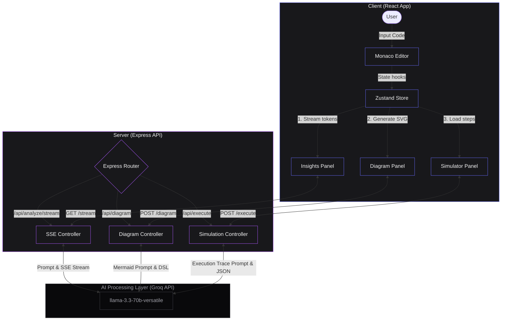

# <p align="center"><svg xmlns="http://www.w3.org/2000/svg" viewBox="0 0 512 512" width="100" height="100" style="margin-bottom: 10px;"><defs><linearGradient id="sparkGradientReadme" x1="0%" y1="0%" x2="100%" y2="100%"><stop offset="0%" stopColor="#A855F7" /><stop offset="100%" stopColor="#6366F1" /></linearGradient><linearGradient id="bracketGradientReadme" x1="0%" y1="0%" x2="0%" y2="100%"><stop offset="0%" stopColor="#F8FAFC" /><stop offset="100%" stopColor="#94A3B8" /></linearGradient><filter id="glowReadme" x="-20%" y="-20%" width="140%" height="140%"><feGaussianBlur stdDeviation="12" result="blur" /><feComposite in="SourceGraphic" in2="blur" operator="over" /></filter></defs><path d="M 190 150 L 70 256 L 190 362" fill="none" stroke="url(#bracketGradientReadme)" strokeWidth="44" strokeLinecap="round" strokeLinejoin="round" /><path d="M 322 150 L 442 256 L 322 362" fill="none" stroke="url(#bracketGradientReadme)" strokeWidth="44" strokeLinecap="round" strokeLinejoin="round" /><path d="M 256 120 C 256 210 210 256 120 256 C 210 256 256 302 256 392 C 256 302 302 256 392 256 C 302 256 256 210 256 120 Z" fill="url(#sparkGradientReadme)" filter="url(#glowReadme)" /></svg><br>CodeInsight</p>

<p align="center">
  <strong>AI-Powered Code Analysis &amp; Execution Visualizer</strong>
</p>

<p align="center">
  <a href="https://code-insight-beta.vercel.app"></a>
  
  
  
  
  
</p>

<p align="center">
  <a href="https://code-insight-beta.vercel.app">🚀 Live Demo</a> • 
  <a href="https://github.com/joshiyj/CodeInsight">📂 View Source</a> • 
  <a href="https://github.com/joshiyj/CodeInsight/issues">🐛 Report Bug</a>
</p>

---

## 📺 Demo

<!-- DEMO_GIF_PLACEHOLDER -->

<!-- Replace demo.gif with actual screen recording before publishing -->

---

## 📖 About

CodeInsight is a developer tool that gives you instant AI-powered feedback on your code — quality scoring, line-level bug detection, automatic flowchart generation, and step-by-step execution simulation. Built for developers who want more than just "it works".

---

## 🚀 Features

*   **⚡ Real-time AI Review via SSE Streaming**
    *   Quality scoring (0-100), time/space complexity analysis, strengths, weaknesses, and concrete recommendations streamed instantly.
*   **🐛 Line-Level Bug Detection**
    *   Issues are mapped to exact line numbers in the Monaco editor with code decorations, descriptions of the root cause, and suggestions for fixes.
*   **🗺️ Automatic Flowchart Generation**
    *   Generates interactive Mermaid.js diagrams to map loop back-edges, condition checks, and assignments. Exportable as high-res PNG.
*   **🎮 Step-by-Step Execution Simulator**
    *   Visual variable tracking, call stack inspection, and console logging at every step of code execution.
*   **🛡️ Abuse Prevention**
    *   Hardened with per-IP rate limiting (requests/minute and daily quotas) and strict input validation.

---

## 🛠️ Tech Stack

| Layer | Technology |
|---|---|
| **Frontend** | React 18, Vite, TailwindCSS |
| **Code Editor** | Monaco Editor (`@monaco-editor/react`) |
| **State Management** | Zustand |
| **Visualization** | Mermaid.js |
| **Rendering** | `react-markdown`, `remark-math`, `rehype-katex` |
| **Backend** | Node.js, Express |
| **AI / LLM** | Groq API (`llama-3.3-70b-versatile`) |
| **Streaming** | Server-Sent Events (SSE) |

---

## 📐 Architecture Diagram



---

## 📂 Project Structure

```text
CodeInsight/
├── backend/
│   └── src/
│       ├── config/
│       │   └── index.js         # Environment variables & CORS configurations
│       ├── middleware/
│       │   └── rateLimiter.js   # Dual-tier (per-minute & daily) rate limit middleware
│       ├── modules/
│       │   ├── ai/
│       │   │   ├── groqClient.js     # Groq LLM client wrapper & stream handlers
│       │   │   ├── promptManager.js  # System prompts assembly orchestrator
│       │   │   └── promptTemplates/  # Raw textual prompt files for AI tasks
│       │   ├── analysis/
│       │   │   └── issueParser.js    # Regex tag parsers & quality score calculator
│       │   ├── execution/
│       │   │   ├── stepEnricher.js   # Inserts index positions for array operations
│       │   │   ├── traceExtractor.js # Coordinates simulator generation steps
│       │   │   └── tracePrompt.js    # LLM trace simulation prompt builder
│       │   └── visualization/
│       │       └── mermaidGenerator.js # Flowchart Mermaid code request builder
│       ├── routes/
│       │   ├── diagram.js       # Endpoint for flowchart rendering
│       │   ├── execute.js       # Endpoint for step trace generation
│       │   └── stream.js        # Server-Sent Events (SSE) router for code reviews
│       ├── utils/
│       │   └── errorUtils.js    # Centered Groq API error string formatter
│       └── server.js            # Express server initialization & routing
└── frontend/
    └── src/
        ├── api/
        │   └── stream.js        # SSE stream listener and RateLimit pre-flight handler
        ├── components/
        │   ├── editor/
        │   │   └── CodeEditor.jsx # Embedded Monaco editor with issue highlights
        │   ├── layout/
        │   │   └── AppLayout.jsx  # Primary page wrapper, header, and resizer controls
        │   ├── panels/
        │   │   ├── AIInsightsPanel.jsx # Formatted markdown insights stream display
        │   │   └── IssueListPanel.jsx  # Accordion panel detailing bug severities
        │   └── visualization/
        │       ├── DiagramPanel.jsx    # Mermaid diagram SVG rendering and export
        │       └── ExecutionSimulator.jsx # Trace player controls, call stack, & state
        ├── store/
        │   ├── analysisStore.js # Zustand store for issues and streamed findings
        │   └── editorStore.js   # Zustand store for selected language and code input
        ├── App.jsx              # React mounting root
        └── main.jsx             # Entry script & Mermaid.js configuration
```

---

## ⚙️ Getting Started

### Prerequisites
*   Node.js (v18.x or higher)
*   A Groq Cloud API Key ([Get one here](https://console.groq.com/))

### 1. Backend Setup
1. Navigate to the backend directory:
   ```bash
   cd backend
   ```
2. Install dependencies:
   ```bash
   npm install
   ```
3. Create a `.env` file in the `backend/` folder:
   ```env
   GROQ_API_KEY=your_groq_api_key_here
   PORT=3001
   NODE_ENV=development
   ```
4. Start the backend development server:
   ```bash
   npm run dev
   ```

### 2. Frontend Setup
1. Navigate to the frontend directory:
   ```bash
   cd ../frontend
   ```
2. Install dependencies:
   ```bash
   npm install
   ```
3. Create a `.env` file in the `frontend/` folder:
   ```env
   VITE_API_URL=http://localhost:3001
   ```
4. Start the frontend development server:
   ```bash
   npm run dev
   ```

---

## ⚠️ Known Limitations

*   **Simulation Capping**: The execution simulator works best with array-based algorithms under 30 lines. Steps are capped to 25 to optimize response times.
*   **Flowchart Complexity**: Diagram accuracy depends on the logical complexity and clarity of the input code structure.
*   **Shared Free-Tier Quotas**: The demo deployment runs on free-tier APIs and enforces daily per-IP usage limits.

---

Created by **Yash Joshi**  
GitHub: [joshiyj](https://github.com/joshiyj)
